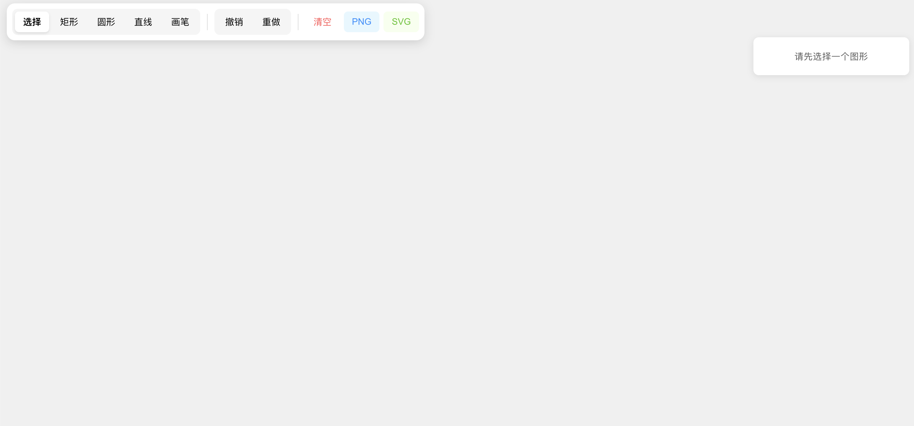

# Online Canvas Tool



A professional-grade, web-based infinite canvas application for drawing and shape manipulation.

## 🚀 Features

- **Drawing Tools**: Rectangle, Circle, Line, and Freehand Pen.
- **Shape Manipulation**: Select, move, scale, and rotate shapes using a transformer.
- **Layer Management**: Bring to front, send to back, move forward/backward.
- **Advanced Controls**: Undo/Redo functionality and shape deletion.
- **Infinite Canvas**: Smooth Zoom and Pan capabilities.
- **Persistence**: Automatic local storage saving/loading.
- **Property Editor**: Customize color, stroke, opacity, and dimensions.
- **Export Capabilities**: Export your creations as high-quality PNG or SVG files.

## 🛠️ Tech Stack

- **React**: UI Library
- **Konva.js**: HTML5 Canvas engine
- **Zustand**: State management
- **Vite**: Build tool

## 📦 Installation & Setup

1. **Clone the repository**:
   ```bash
   git clone https://github.com/Rcwalter24/online-canvas.git
   cd online-canvas
   ```

2. **Install dependencies**:
   ```bash
   npm install
   ```

3. **Run development server**:
   ```bash
   npm run dev
   ```

4. **Build for production**:
   ```bash
   npm run build
   ```

## 📖 How to Use

1. **Select a Tool**: Choose from the toolbar (Rect, Circle, Line, Pen, Select, Pan).
2. **Draw**: Click and drag on the canvas to create shapes.
3. **Transform**: Click a shape to select it, then use the transformer handles to resize or rotate.
4. **Edit Properties**: Use the sidebar to change colors or opacity.
5. **Navigate**: Use the Pan tool to move around, or use the mouse wheel to zoom.
6. **Undo/Redo**: Use the buttons in the toolbar to revert or re-apply actions.
7. **Export**: Use the export buttons to download your work as PNG or SVG.

---

# 在线绘图板


一个专业级的、基于 Web 的无限画布应用程序，支持形状操作和绘图。

## 🚀 功能特性

- **绘图工具**: 矩形、圆形、直线以及自由手绘画笔。
- **形状操作**: 使用转换器进行选择、移动、缩放和旋转。
- **图层管理**: 置顶、置底、上移、下移。
- **高级控制**: 支持撤销/重做 (Undo/Redo) 和形状删除。
- **无限画布**: 平滑的缩放 (Zoom) 和平移 (Pan) 功能。
- **数据持久化**: 自动保存到本地存储 (localStorage)。
- **属性编辑器**: 自定义颜色、描边、透明度和尺寸。
- **导出功能**: 支持将作品导出为高质量的 PNG 或 SVG 文件。

## 🛠️ 技术栈

- **React**: UI 框架
- **Konva.js**: HTML5 Canvas 引擎
- **Zustand**: 状态管理
- **Vite**: 构建工具

## 📦 安装与启动

1. **克隆仓库**:
   ```bash
   git clone https://github.com/Rcwalter24/online-canvas.git
   cd online-canvas
   ```

2. **安装依赖**:
   ```bash
   npm install
   ```

3. **启动开发服务器**:
   ```bash
   npm run dev
   ```

4. **生产环境构建**:
   ```bash
   npm run build
   ```

## 📖 使用说明

1. **选择工具**: 从工具栏选择工具 (矩形、圆形、直线、画笔、选择、平移)。
2. **绘图**: 在画布上点击并拖动以创建形状。
3. **变换**: 点击形状进行选中，使用转换器手柄进行缩放或旋转。
4. **编辑属性**: 使用侧边栏修改颜色或透明度。
5. **画布导航**: 使用平移工具移动，使用鼠标滚轮缩放。
6. **撤销/重做**: 使用工具栏按钮撤销或恢复操作。
7. **导出**: 使用导出按钮将您的工作下载为 PNG 或 SVG。
